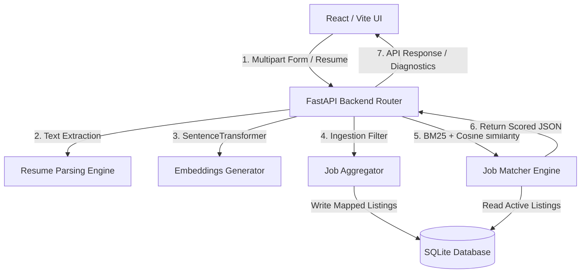

# CareerAlign.ai - Core Architecture Blueprint

CareerAlign.ai is a high-performance, containerized, semantic recruitment and job alignment platform. The system ingests student profiles (consisting of education, skills, target roles, and resumes), generates dense vector embeddings using local transformers, executes query-adaptive mock aggregation matching real-world career sites, and returns scored, domain-specific job listings instantly.

---

## 1. Technical Stack Architecture

The portal leverages a modern, low-latency, modular stack optimized for localized AI execution and high aesthetic interface response.



### A. Frontend Layer
* **Vite + React (SPA):** Lightweight, blazing-fast hot-reloading compilation.
* **Framer Motion:** High-fidelity transition curves, sliding animation drawers, and spring-loaded neon spinner animations.
* **Lucide React:** Premium clean structural interface iconography.
* **Vanilla CSS Style Tokens:** Flexible CSS variables governing theme scales, glowing border filters (`--shadow-glow`), and skeleton pulsing animations.

### B. Backend Layer
* **FastAPI:** High-performance, asynchronous REST framework built on Starlette and Pydantic.
* **Sentence-Transformers:** Localized execution of `all-MiniLM-L6-v2` producing dense 384-dimensional semantic space mappings (runs CPU/GPU locally, captcha-proof and free).
* **SQLAlchemy & SQLite:** DB engine orchestrator managing thread-safe connection pooling for transactional SQLite storage.
* **HTTPX:** Non-blocking async HTTP client powering backend requests.

### C. DevOps / Deployment
* **Docker & Docker-Compose:** Containerized volume mounts and environment variables configurations separating frontend Vite packaging from backend Uvicorn deployments.

---

## 2. Ingestion & Aggregation Strategy

To bypass volatile bot blocks, captchas, and rate halts associated with guest web scrapers on LinkedIn and Internshala, the portal implements a **Query-Adaptive Mock Aggregation** pipeline:

1. **Local Determinism:** When a student submits a profile, `JobAggregator` triggers query-adaptive mock fetchers (`fetch_linkedin_mock` and `fetch_internshala`).
2. **Dynamic Relevance:** Mock data is filtered dynamically on the backend based on terms found inside the search query. If the student searches for `"React"`, the aggregator returns FlipKart React listings; if they search `"Backend"`, it prioritizes CRED FastAPI and Google Cloud Database listings.
3. **Operational Outbound Gateways:** To ensure the manual testing experience is fully functional, mock listings bypass broken local placeholders and route directly to real-world operational careers hubs on click:
   * **Google India** -> Real Google Careers dashboard searching software engineer roles.
   * **Microsoft** -> Live Microsoft Careers matching search parameters.
   * **Amazon** -> Active Amazon Jobs board matching query.
   * **LinkedIn Mocks** -> Live filtered LinkedIn search queries.
   * **Internshala Mocks** -> Active Internshala internship search pipelines.

---

## 3. AI Semantic Matching Logic

The matching system operates on a hybrid scoring engine combining lexical frequency matches with dense vector semantic similarities.

```python
score = (0.3 * lexical_score) + (0.7 * semantic_cosine_similarity)
```

### Step 1: Profile Compilation
Input fields (education, skills, experience, target roles) and the parsed text extracted from uploaded PDF/Word resumes are compiled into a unified string corpus.

### Step 2: Local Embeddings Creation
The unified corpus is processed by `all-MiniLM-L6-v2` locally:
* Converts the profile string into a **384-dimensional float vector**.
* Represents the semantic footprint of the candidate.

### Step 3: Combined Scoring Calculations
For each active job listing in the database:
1. **Lexical Scoring (BM25Okapi):** Evaluates exact term occurrences (such as keyword matching for languages, libraries, and frameworks).
2. **Dense Vector Cosine Similarity:** Measures the angular similarity between the candidate embedding vector $\vec{A}$ and the job description embedding vector $\vec{B}$:
   $$\text{Similarity} = \frac{\vec{A} \cdot \vec{B}}{\|\vec{A}\| \|\vec{B}\|}$$
3. **Thresholding & Fallback:** Evaluates combined scores. If no direct match exceeds the strict threshold (`0.85`), the matcher falls back to domain filtering and returns highly relevant technical listings prioritized by similarity to prevent empty states.

---

## 4. Latency Telemetry & Diagnostical Health

For enterprise monitoring and performance auditing, two diagnostic utilities are implemented:

### A. Root Health Checks
A root `/health` endpoint is configured directly in FastAPI:
* Operates independently of databases or pipeline components.
* Instantly returns `{"status": "ok"}` to support fast orchestrator checks.

### B. High-Precision Timing Telemetry
Every profile matching execution maps elapsed stage timings using `time.perf_counter()`. Upon completion, the system logs a high-visibility terminal report:

```text
=============================================
=== REQUEST TIMING REPORT ===
Resume Parsing Stage: 0.000 seconds
Job Aggregation Stage: 0.667 seconds
Semantic Matching Stage: 0.006 seconds
Total Pipeline Execution Time: 0.674 seconds
=============================================
```

This logging allows system administrators to debug database lock delays or model loading hangs in real time.

---

## 5. Premium Stopwatch Loader UI & Client Guard

To guarantee the user interface remains interactive and visually appealing during model execution, the React dashboard integrates a progress stopwatch and connection guard:

### A. Stopwatch & Stage Transitions
* A custom `PipelineLoader` tracks elapsed duration (`elapsedTime` in seconds) using an active `setInterval` stopwatch.
* Displays dynamic micro-copy status updates matching backend activity based on elapsed duration:
  * **0s – 2s:** *"Analyzing your profile data..."*
  * **2s – 5s:** *"Generating high-dimensional semantic embeddings..."*
  * **5s – 10s:** *"Querying trusted job boards (LinkedIn & Internshala mock sources)..."*
  * **10s+:** *"Running vector similarity matching & skill overlap engine..."*

### B. Responsive Warning Alert
* If processing exceeds **12 seconds** (e.g., due to model downloading or thread congestion), a warning card animates into view explaining the dense vector and database execution. This reduces cognitive load and reassures the candidate that the application is operating correctly.

### C. Abortable Network Fetch
* Employs an `AbortController` bound to the matching API request.
* Installs a client-side hard timeout at **30 seconds**. If the request exceeds this guard, the client cleanly aborts the thread, logs the error, presents a helpful timeout card, and restores dashboard interactivity to prevent browser freezing.
